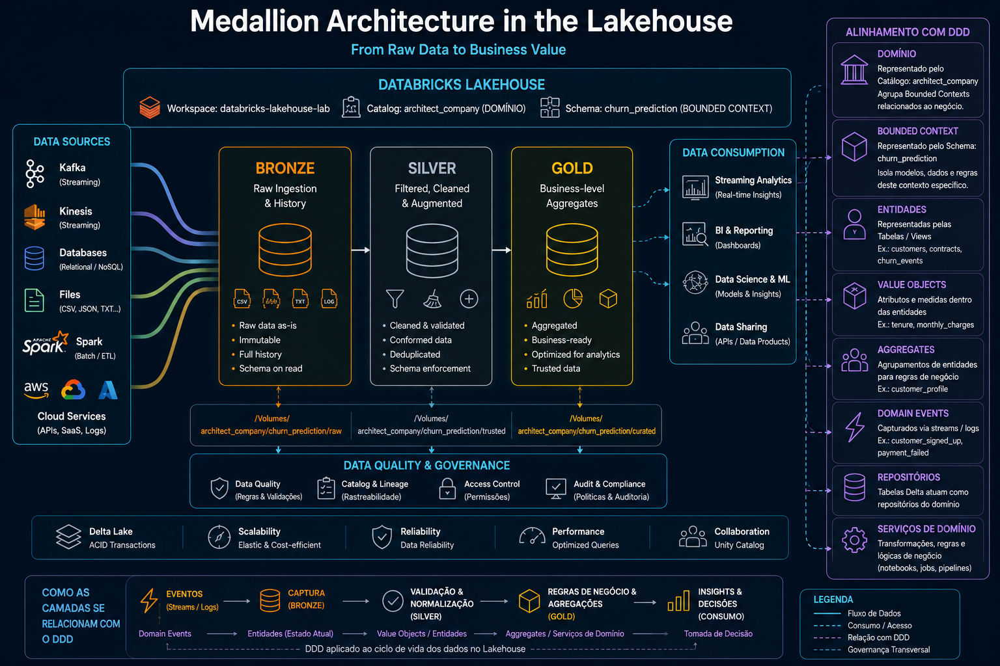

# Databricks Lakehouse Lab

Projeto de estudos para integração com **Databricks**, **AWS** e **GitHub**.

O objetivo é construir um mini Lakehouse moderno utilizando um fluxo profissional com:

- Datamesh e DDD como guia de organização
- Workspace, Catalog, Schema e Volumes no Databricks
- Dataset do Kaggle
- Processamento com Apache Spark
- Armazenamento em Delta Lake
- Versionamento com GitHub
- AWS para armazenamento e computação

---

## Arquitetura



> Arquitetura Medallion (Bronze → Silver → Gold) aplicada ao Lakehouse com alinhamento DDD.
> Catalog `architect_company` representa o Domínio; Schema `churn_prediction` o Bounded Context.

## Estrutura Databricks

```text
Workspace
└── databricks-lakehouse-lab

Catalog
└── architect_company

Schema
└── churn_prediction

Volumes
├── raw
├── trusted
└── curated
```

---

## Estrutura Git

```text
databricks-lakehouse-lab/
│
├── churn-prediction/
│   │
│   └── notebook/
│       ├── 01.raw_churn_prediction_notebook.ipynb
│       └── 02.trusted_layer_churn_prediction_notebook.ipynb
│       └── 03.curated_layer_churn_prediction_notebook.ipynb
```

---

## Estrutura Lakehouse (Delta Tables)

```text
architect_company
└── churn_prediction
    ├── raw_customers
    ├── trusted_customers
    └── customer_churn_kpis
```

---

## Dataset

[Customer Churn Dataset — Kaggle](https://www.kaggle.com/datasets/muhammadshahidazeem/customer-churn-dataset)

O dataset contém informações de clientes de uma empresa de telecomunicações, incluindo dados demográficos, serviços contratados e se o cliente cancelou ou não o serviço (churn).

Arquivo esperado após download:

```text
customer_churn_dataset-training-master.csv
```

---

## Passo a Passo

### Passo 1 — Baixar o Dataset do Kaggle

Baixe o CSV e faça upload no Databricks.

---

### Passo 2 — Criar Catalog

No SQL Editor do Databricks:

```sql
CREATE CATALOG IF NOT EXISTS architect_company;
```

---

### Passo 3 — Criar Schema

```sql
CREATE SCHEMA IF NOT EXISTS architect_company.churn_prediction;
```

---

### Passo 4 — Criar Volumes

```sql
-- RAW
CREATE VOLUME IF NOT EXISTS architect_company.churn_prediction.raw;

-- TRUSTED
CREATE VOLUME IF NOT EXISTS architect_company.churn_prediction.trusted;

-- CURATED
CREATE VOLUME IF NOT EXISTS architect_company.churn_prediction.curated;
```

---

### Passo 5 — Upload do CSV

No **Catalog Explorer**:

```
Catalog Explorer
→ architect_company
→ churn_prediction
→ raw
```

Faça upload do CSV. O caminho ficará:

```
/Volumes/architect_company/churn_prediction/raw/customer_churn.csv
```

---

### Passo 6 — Notebook: `01.raw_churn_prediction_notebook.ipynb`

Leia o CSV com Spark e salve como Delta Table na camada RAW:

```python
# Ler CSV
df = spark.read.format("csv") \
    .option("header", "true") \
    .option("inferSchema", "true") \
    .load("/Volumes/architect_company/churn_prediction/raw/customer_churn.csv")

display(df)

# Salvar como Delta Table
df.write.format("delta") \
    .mode("overwrite") \
    .saveAsTable("architect_company.churn_prediction.raw_customers")
```

Consultar com SQL:

```sql
SELECT *
FROM architect_company.churn_prediction.raw_customers
LIMIT 10;
```

---

### Passo 7 — Notebook: `02.trusted_layer_churn_prediction_notebook.ipynb`

Limpeza e tratamento dos dados:

```python
from pyspark.sql.functions import col

trusted_df = df.dropDuplicates()
trusted_df = trusted_df.fillna({"Age": 0})

trusted_df.write.format("delta") \
    .mode("overwrite") \
    .saveAsTable("architect_company.churn_prediction.trusted_customers")
```

---

### Passo 8 — Notebook: `03.curated_layer_churn_prediction_notebook.ipynb` *(a criar)*

KPIs, features e agregações analíticas:

```python
from pyspark.sql.functions import avg

curated_df = trusted_df.groupBy("Age") \
    .agg(avg("Churn").alias("avg_churn"))

curated_df.write.format("delta") \
    .mode("overwrite") \
    .saveAsTable("architect_company.churn_prediction.customer_churn_kpis")
```

---

## Conceitos Abordados

| Conceito       | Tecnologia                    |
| -------------- | ----------------------------- |
| Lakehouse      | Databricks                    |
| Storage        | Volumes                       |
| Governança     | Catalog / Schema              |
| Engenharia     | Apache Spark                  |
| Tabela moderna | Delta Lake                    |
| Analytics      | SQL                           |
| Pipeline       | Bronze / Silver / Gold        |
| Versionamento  | GitHub                        |

---

## Databricks, DDD e GitHub

Este projeto aplica, de forma prática, conceitos de **Domain-Driven Design (DDD)** na engenharia de dados usando Databricks e GitHub como pilares de governança e versionamento.

### Domínio e Subdomínio

No DDD, o negócio é organizado em **domínios** e **subdomínios**. Aqui, essa divisão se reflete diretamente na estrutura do Catalog:

| DDD            | Databricks                         |
| -------------- | ---------------------------------- |
| Domínio        | Catalog (`architect_company`)   |
| Subdomínio     | Schema (`churn_prediction`)        |
| Agregado       | Delta Table (`raw_customers`, ...) |
| Value Object   | Coluna / campo da tabela           |

### Bounded Context

Cada **Schema** representa um `Bounded Context` isolado. Dados de `churn_prediction` não se misturam com dados de outros domínios. O Catalog é a fronteira explícita de linguagem e responsabilidade.

```text
architect_company          ← Domínio
└── churn_prediction           ← Bounded Context
    ├── raw_customers          ← Agregado (estado bruto)
    ├── trusted_customers      ← Agregado (estado confiável)
    └── customer_churn_kpis    ← Agregado (estado analítico)
```

### Ubiquitous Language

Os nomes de tabelas, volumes e notebooks seguem a **linguagem ubíqua** do domínio de negócio (churn, customers, geography, age), tornando o código compreensível tanto por engenheiros quanto por analistas e stakeholders.

### Camadas e Responsabilidades

A pipeline Bronze → Silver → Gold do Lakehouse mapeia diretamente as camadas de domínio do DDD:

| Camada Lakehouse | DDD                   | Responsabilidade                        |
| ---------------- | --------------------- | --------------------------------------- |
| Raw (Bronze)     | Infrastructure Layer  | Ingestão fiel da fonte externa          |
| Trusted (Silver) | Domain Layer          | Regras de limpeza e consistência        |
| Curated (Gold)   | Application Layer     | KPIs, features e entrega ao consumidor  |

### GitHub como repositório do Domínio

O repositório Git não armazena apenas código — ele versiona o **modelo do domínio**:

| Artefato Git              | Equivalente DDD                        |
| ------------------------- | -------------------------------------- |
| Branch `main`             | Versão estável do modelo               |
| Branch por feature        | Evolução incremental do domínio        |
| Notebook `01.raw_churn_prediction_notebook`          | Anti-Corruption Layer (ACL)            |
| Notebook `02.trusted_layer_churn_prediction_notebook` | Domain Service (transformação)         |
| Notebook `03.curated_layer_churn_prediction_notebook`  | Application Service (entrega)          |
| Pull Request              | Revisão de mudança no modelo           |
| Commit message            | Registro de decisões de domínio (ADR)  |

### Visão Integrada

```text
GitHub (versionamento do modelo)
    │
    └── Databricks Workspace
            │
            └── Catalog: architect_company  (Domínio)
                    │
                    └── Schema: churn_prediction  (Bounded Context)
                            │
                            ├── Volume raw       → 01.raw_churn_prediction_notebook.ipynb (ACL)
                            ├── Volume trusted   → 02.trusted_layer_churn_prediction_notebook.ipynb (Domain Service)
                            └── Volume curated   → 03.curated_layer_churn_prediction_notebook.ipynb (Application Service)
```

---

## Referências

- [Databricks Free Edition](https://www.databricks.com/learn/free-edition)
- [Databricks Documentation](https://docs.databricks.com/)
- [Delta Lake](https://delta.io/)
- [Apache Spark](https://spark.apache.org/)
- [Kaggle Dataset](https://www.kaggle.com/datasets/muhammadshahidazeem/customer-churn-dataset)
- [Domain-Driven Design — Eric Evans](https://www.domainlanguage.com/ddd/)
- [Data Mesh Principles — Zhamak Dehghani](https://martinfowler.com/articles/data-mesh-principles.html)
